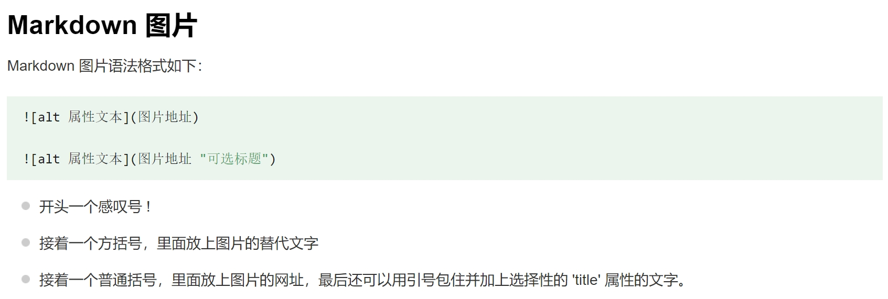

---
html:
  embed_local_images: true
  embed_svg: true
  offline: true
  toc: true

print_background: false
---

<h1 style="text-align:center; font-family:Times New Roman; color:blue;">
  Markdown<span style="font-family:SimSun;">入门教程</span>
</h1>

<h2 style="text-align:center; font-family:Times New Roman; font-size:20pt;">
  shanbo
</h2>

[TOC]

---

## 一、准备工作 {#1}
1. **安装 VS Code**  
   [vscode 官网下载地址](https://code.visualstudio.com/)
2. **下载必要的插件**
   - Markdown Preview Enhanced
   - Paste Image
3. **创建 `.md` 文档，打开同步预览功能，开始编辑**

---

## 二、基本语法 {#2}

1. **标题**
   # Heading level 1
   <h1>Heading level 1</h1>

   ## Heading level 2
   <h2>Heading level 2</h2>

   ### Heading level 3
   <h3>Heading level 3</h3>

   #### Heading level 4
   <h4>Heading level 4</h4>

   ##### Heading level 5
   <h5>Heading level 5</h5>

   ###### Heading level 6
   <h6>Heading level 6</h6>

   Heading level 1
   =
   Heading level 2
   -

2. **段落**  
   I really like using Markdown.

   I think I'll use it to format all of my documents from now on.

   <p>I really like using Markdown.</p>

   <p>I think I'll use it to format all of my documents from now on.</p>

3. **换行**  
   在一行的末尾添加两个或多个空格，然后按回车键，即可创建一个换行。  
   This is the first line.  
   And this is the second line.

   <p>This is the first line.<br>
   And this is the second line.</p>

4. **强调**  
   I just love **bold text**.  
   I just love <strong>bold text</strong>.

   I just love __bold text__.  
   I just love <strong>bold text</strong>.

   Love**is**bold  
   Love<strong>is</strong>bold

   Italicized text is the *cat's meow*.  
   Italicized text is the <em>cat's meow</em>.

   Italicized text is the _cat's meow_.  
   Italicized text is the <em>cat's meow</em>.

   A*cat*meow  
   A<em>cat</em>meow

   This text is ***really important***.  
   This text is <strong><em>really important</em></strong>.

   This text is ___really important___.  
   This text is <strong><em>really important</em></strong>.

   This text is __*really important*__.  
   This text is <strong><em>really important</em></strong>.

   This text is **_really important_**.  
   This text is <strong><em>really important</em></strong>.

   This is really***very***important text.  
   This is really<strong><em>very</em></strong>important text.

   | 字体 | 代码 |
   |:-:|:-:|
   | *斜体* | `*斜体*` |
   | **粗体** | `**粗体**` |
   | ***斜粗体*** | `***斜粗体***` |
   | ~~删除线~~ | `~~删除线~~` |
   | <ins>下划线</ins> | `<ins>下划线</ins>`<br>`<u>下划线</u>` |
   | ==高亮== | `==高亮==` |

5. **引用**
   > Dorothy followed her through many of the beautiful rooms in her castle.

   > Dorothy followed her through many of the beautiful rooms in her castle.
   >
   > The Witch bade her clean the pots and kettles and sweep the floor and keep the fire fed with wood.

   > Dorothy followed her through many of the beautiful rooms in her castle.
   >
   >> The Witch bade her clean the pots and kettles and sweep the floor and keep the fire fed with wood.

   > #### The quarterly results look great!
   >
   > - Revenue was off the chart.
   > - Profits were higher than ever.
   >
   >  *Everything* is going according to **plan**.

6. **列表**
   1. First item
   2. Second item
   3. Third item
   4. Fourth item
   <ol>
   <li>First item</li>
   <li>Second item</li>
   <li>Third item</li>
   <li>Fourth item</li>
   </ol>

   1. First item
   2. Second item
   3. Third item
      1. Indented item
      2. Indented item
   4. Fourth item
   <ol>
   <li>First item</li>
   <li>Second item</li>
   <li>Third item
   <ol>
   <li>Indented item</li>
   <li>Indented item</li>
   </ol>
   </li>
   <li>Fourth item</li>
   </ol>

   - First item
   - Second item
   - Third item
   - Fourth item
   <ul>
   <li>First item</li>
   <li>Second item</li>
   <li>Third item</li>
   <li>Fourth item</li>
   </ul>

   * First item
   * Second item
   * Third item
   * Fourth item
   <ul>
   <li>First item</li>
   <li>Second item</li>
   <li>Third item</li>
   <li>Fourth item</li>
   </ul>

   + First item
   + Second item
   + Third item
   + Fourth item
   <ul>
   <li>First item</li>
   <li>Second item</li>
   <li>Third item</li>
   <li>Fourth item</li>
   </ul>

   - First item
   - Second item
   - Third item
     - Indented item
     - Indented item
   - Fourth item
   <ul>
   <li>First item</li>
   <li>Second item</li>
   <li>Third item
   <ul>
   <li>Indented item</li>
   <li>Indented item</li>
   </ul>
   </li>
   <li>Fourth item</li>
   </ul>

7. **代码**  
   At the command prompt, type `nano`.  
   At the command prompt, type <code>nano</code>.

   如果你要表示为代码的单词或短语中包含一个或多个反引号，则可以通过将单词或短语包裹在双反引号(``)中。

   ``Use `code` in your Markdown file.``  
   <code>Use `code` in your Markdown file.</code>

   要创建代码块，请将代码块的每一行缩进至少四个空格或一个制表符。

       <html>
          <head>
          </head>
       </html>

8. **分割线**
   ***

   ---

   ___

9. **链接**  
   链接title是当鼠标悬停在链接上时会出现的文字，这个title是可选的，它放在圆括号中链接地址后面，跟链接地址之间以空格分隔。  
   这是一个链接 [Markdown语法](https://markdown.com.cn)。  
   这是一个链接 [Markdown语法](https://markdown.com.cn "最好的markdown教程")。  
   这是一个链接 <a href="https://markdown.com.cn" title="最好的markdown教程">Markdown语法</a>。

   使用尖括号可以很方便地把URL或者email地址变成可点击的链接。  
   <https://markdown.com.cn>  
   <fake@example.com>

10. **图片**
    - 加载本地图片
      
    - 加载网络图片，推荐使用[路过图床](https://imgse.com/)保存图片
    - 使用 Markdown 语法插入图片（图片不支持跳转）：
      
      
    - 使用 Markdown 语法插入图片（图片不支持跳转）：
      
    - 使用 Markdown 语法插入图片（图片支持跳转）：
      [](https://imgse.com/i/pFZHwAe)
    - 使用 HTML 插入图片，控制图片大小和位置（图片支持跳转）：
      <div align="center">
        <a href="https://imgse.com/i/pFZHwAe">
          
        </a>
      </div>

11. **转义**  
    要显示原本用于格式化 Markdown 文档的字符，请在字符前面添加反斜杠字符 \ 。  
    \* Without the backslash, this would be a bullet in an unordered list.

12. **内嵌 HTML 标签**  
    - 行级内联标签  
      This **word** is bold. This <em>word</em> is italic.

    - 区块标签  
      This is a regular paragraph.

      <table>
        <tr>
          <td>Foo</td>
        </tr>
      </table>

      This is another regular paragraph.

---

## 三、扩展语法 {#3}

1. **表格**
   | Syntax      | Description |
   | ----------- | ----------- |
   | Header      | Title       |
   | Paragraph   | Text        |

   | Syntax      | Description | Test Text     |
   | :---        |    :----:   |          ---: |
   | Header      | Title       | Here's this   |
   | Paragraph   | Text        | And more      |

   您可以使用表格的HTML字符代码（`&#124;`）在表中显示竖线（&#124;）字符。

2. **围栏代码块**
   ```C {.line-numbers}
   #include<iostream>
   using namespace std;
   int main() {
       print("hello world");
   }
   ```

3. **脚注**
   - 更多使用教程可以参考网站[^1]
   - 更多使用教程可以参考网站[^2]

4. **标题编号**  
   许多Markdown处理器支持标题的自定义ID - 一些Markdown处理器会自动添加它们。添加自定义ID允许您直接链接到标题并使用CSS对其进行修改。要添加自定义标题ID，请在与标题相同的行上用大括号括起该自定义ID。
   ### My Great Heading {#custom-id}
   <h3 id="custom-id">My Great Heading</h3>

5. **定义列表**

   First Term
   : This is the definition of the first term.

   Second Term
   : This is one definition of the second term.
   : This is another definition of the second term.

   <dl>
   <dt>First Term</dt>
   <dd>This is the definition of the first term.</dd>
   <dt>Second Term</dt>
   <dd>This is one definition of the second term. </dd>
   <dd>This is another definition of the second term.</dd>
   </dl>

6. **删除线**  
   ~~世界是平坦的。~~ 我们现在知道世界是圆的。

7. **任务列表**
   - [x] Write the press release
   - [ ] Update the website
   - [ ] Contact the media

8. **Emoji**  
   去露营了！ :tent: 很快回来。

   真好笑！ :joy:

9. **自动网址链接**  
   许多Markdown处理器会自动将URL转换为链接。这意味着如果您输入https://markdown.com.cn，即使您未使用方括号，您的Markdown处理器也会自动将其转换为链接。

10. **LaTex公式**
    - 行内显示公式：
      - 数学公式：$f(x)=ax+b$
      - 化学公式：$\ce{Hg^2+ ->[I-] HgI2 ->[I-] [Hg^{II}I4]^2-}$
    - 块内显示公式：
      - 示例一
      $$
      \begin{Bmatrix}
      a & b \\
      c & d
      \end{Bmatrix}
      $$
      - 示例二 泰勒展开
      $$
      f(x)=f(a)+f'(a)(x-a)+\tfrac{f''(a)}{2!}(x-a)^{2}+\cdots
      $$
      - 示例三
      $$H(D_2) = -\left(\frac{2}{4}\log_2 \frac{2}{4} + \frac{2}{4}\log_2 \frac{2}{4}\right) = 1$$
      - 示例四 矩阵
      $$
      \begin{pmatrix}
      1 & a_1 & a_1^2 & \cdots & a_1^n \\
      1 & a_2 & a_2^2 & \cdots & a_2^n \\
      \vdots & \vdots & \vdots & \ddots & \vdots \\
      1 & a_m & a_m^2 & \cdots & a_m^n \\
      \end{pmatrix}
      $$

11. **上标、下标**
    - 30^th^
    - H~2~O

12. **缩略**  
    *[HTML]: Hyper Text Markup Language  
    *[W3C]: World Wide Web Consortium  
    The HTML specification
    is maintained by the W3C.

---

## 四、变通 {#4}

1. **下划线**  
   一些文字 <ins>将被加下划线</ins>。  
   一些文字 <u>将被加下划线</u>。

2. **缩进（Tab）**  
   &nbsp;&nbsp;&nbsp;&nbsp;这是一个缩进的段落。

3. **文字居中**
   <p style="text-align:center">这段文字居中显示。</p>

4. **文字颜色**  
   <font color="red">这段文字是红色的！</font>
   <p style="color:blue">这段文字是蓝色的。</p>

5. **注释**  
   这是可见的段落。

   [这是一个隐藏的注释]: # 

   这是另一个可见的段落。

6. **警告**
   > :warning: **警告：** 不要按下大红色按钮！

   > :memo: **注意：** 日出很美。

   > :bulb: **提示：** 记得珍惜生活中的小事。

7. **调整图片大小**  
   

8. **新标签打开链接**  
   Markdown 不能指定 target="_blank"，但 HTML 可以：  
   <a href="https://markdown.com.cn" target="_blank">学习 Markdown！</a>

9. **图片标题**
   <figure>
     
     <figcaption>这是一张描述图片。</figcaption>
   </figure>

   
   *这是一张描述图片。*

10. **符号（特殊字符）**  
   Markdown 不能直接插入特殊符号，但可以复制粘贴，或者使用 HTML 实体：  
   版权 (©) — &copy;  
   注册商标 (®) — &reg;  
   商标 (™) — &trade;  
   欧元 (€) — &euro;  
   左箭头 (←) — &larr;  
   上箭头 (↑) — &uarr;  
   右箭头 (→) — &rarr;  
   下箭头 (↓) — &darr;  
   度数 (°) — &#176;  
   圆周率 (π) — &#960;

11. **表格格式**  
    Markdown 不能直接在表格中换行或插入列表，但可以用 HTML 解决：
    - 表格内换行
      | 语法      | 描述         |
      | --------- | ----------- |
      | 换行      | 第一段。<br><br>第二段。 |
    - 表格内列表
      | 语法      | 描述         |
      | --------- | ----------- |
      | 列表      | <ul><li>项目一</li><li>项目二</li></ul> |

12. **目录**  
    某些 Markdown 解析器支持自动目录生成（如 Markdeep），但如果不支持，可以手动创建：
    #### 目录
    - [一、准备工作](#1)
    - [二、基本语法](#2)
    - [三、扩展语法](#3)
    - [四、变通](#4)
    - [五、导出文档](#5)

13. **插入视频**  
    Markdown 不能直接嵌入视频，但可以使用 HTML，或变通方式（图片+链接）  
    点击B站的分享图标，然后选择嵌入链接，会获得如下代码：  
    <iframe src="https://player.bilibili.com/player.html?isOutside=true&aid=273997011&bvid=BV1Lc411F7H4&cid=1238581369&p=1" scrolling="no" border="0" frameborder="no" framespacing="0" allowfullscreen="true" width="100%" height="400px"></iframe>

    或者  
    [](https://www.bilibili.com/video/BV1Lc411F7H4/?share_source=copy_web&vd_source=806aa147fa01efa4e9ba030a0f0ec102)

---

## 五、导出文档 {#5}
   - 导出为PDF文档：Open in Browser -> 打印 -> 另存为 PDF
   - 导出为HTML文档：Export -> HTML -> HTML (office)

[^1]: [更多使用教程可以参考网站](https://markdown.com.cn)
[^2]: [更多使用教程可以参考网站](https://shd101wyy.github.io/markdown-preview-enhanced/#/zh-cn/)